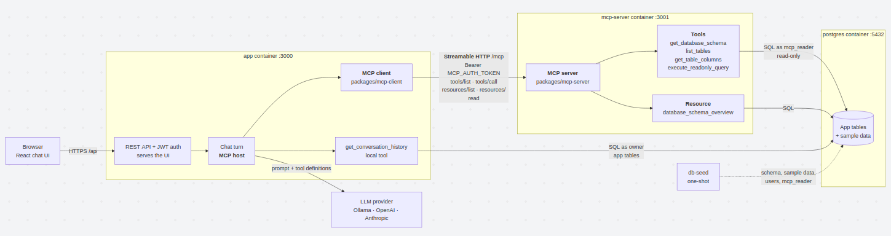
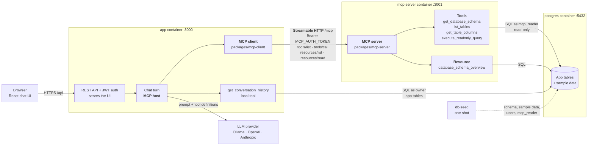
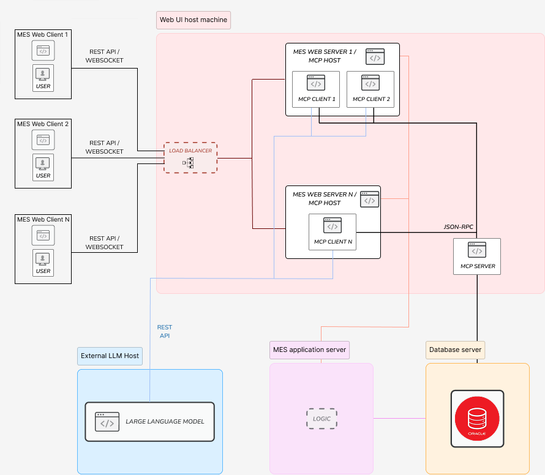

# Database-Aware LLM Chat Assistant

A chat API and web UI that lets an LLM answer questions about a SQL database. The model never touches the database directly. It calls a small set of validated, read-only tools, and the app runs them and feeds the results back.

Deployed at: https://chat.miska-mynttinen.fi/

## Architecture

A simplified view of the containers in `docker-compose.yaml` and where each part of the MCP protocol lives. The monitoring stack is left out, see [Monitoring](#monitoring).





The app is the MCP **host**: its chat turn decides when the LLM's tool calls go to the MCP **client**, which talks to the MCP **server** over the Streamable HTTP **transport**. At startup the client lists the server's tools and resources. The tools are offered to the LLM, and the schema overview resource is put in its system prompt. The MCP server connects as the read-only `mcp_reader` login, so it can't see the app tables or write anything.

## Original Thesis Architecture




## General

The LLM backend and the database can each be swapped through their own config file (`.env.llm` and `.env.database`), with no code changes:

| | Supported |
| --- | --- |
| LLM providers | OpenAI, Anthropic, Ollama (or any OpenAI/Anthropic-compatible endpoint) |
| Databases | SQLite, PostgreSQL, MySQL |
| External tools | Any number of MCP servers over Streamable HTTP |

This file covers running, configuring and using the app. [ARCHITECTURE.md](ARCHITECTURE.md) covers the design, the glossary, extending the app, and testing.

## How it works

1. You send a question, such as "Which tables reference `users`?", to `POST /api/chat`.
2. The app sends the question, recent session history, and the tool definitions to the configured LLM.
3. If the model asks for a tool, the app validates and runs it, then returns the result to the model. This repeats for up to 4 rounds.
4. The model's final answer is saved to the session and returned together with every tool call it made.

The LLM's tools come from the MCP servers listed in `MCP_SERVER_URLS`, named `mcp_server_<n>_<tool>`. The bundled [MCP server](#mcp-server) serves the database tools:

| Tool | Purpose |
| --- | --- |
| `get_database_schema` | Tables and columns, optionally for one table |
| `list_tables` | Table names, optionally for one schema |
| `get_table_columns` | Column definitions for one table |
| `execute_readonly_query` | One read-only `SELECT`, row-limited |

The app serves one tool itself, `get_conversation_history`: messages of the current user that aren't in the model's context, from the user's earlier conversations (the default) or older messages of the current one. It reads the app's own tables, which the MCP server can't see. Without an MCP server the LLM has no database tools, and the app logs a warning at startup.

## Quick start

Requires Node.js 20.12 or newer. Both options below use a local model through [Ollama](https://ollama.com). For a hosted model, see [LLM](#llm-envllm).

### Local, with Ollama

1. **Install Ollama and pull a model.** On Linux, run `curl -fsSL https://ollama.com/install.sh | sh`. On macOS and Windows, use the installer from [ollama.com/download](https://ollama.com/download). Then:

   ```bash
   curl http://localhost:11434/api/version   # if this fails: ollama serve
   ollama pull qwen2.5:3b                    # ~1.9 GB, runs on a CPU with ~4 GB free RAM
   ```

   You don't need `ollama run`. Ollama runs as a background service on port `11434` and loads the model on the first request from the app, which is why the first answer is slower. `ollama run qwen2.5:3b` only opens a terminal chat, which is useful for checking that the model works. `ollama ps` shows which models are loaded.

2. **Create the config files** from their templates:

   ```bash
   cp .env.llm.example .env.llm
   cp .env.database.example .env.database
   cp .env.mcp.example .env.mcp
   cp .env.limits.example .env.limits   # optional
   cp .env.example .env
   ```

   In `.env.llm`, set:

   ```env
   LLM_PROVIDER=ollama
   LLM_MODEL=qwen2.5:3b
   LLM_BASE_URL=http://localhost:11434
   LLM_TOOL_CALLING=native
   ```

   In `.env.database`, point at the PostgreSQL started below: `DB_TYPE=postgres`, `DB_HOST=localhost`, `DB_PORT=5432`, `DB_USER=postgres`, `DB_PASSWORD=password`, `DB_NAME=testdb`. Also set `DB_READONLY_USER=mcp_reader` with a `DB_READONLY_PASSWORD` of your choice. To skip Docker, keep the template's SQLite file instead.

   `.env` already has development values for `JWT_SECRET` and `SEED_USER_PASSWORD=password`. Replace them anywhere the app is reachable by others.

3. **Build, seed, and start** each part in order:

   ```bash
   npm install
   npm --prefix frontend install
   npm run build                  # the packages, the app, and the frontend

   docker compose up -d postgres  # Setup with Postgres, skip for SQLite
   npm run seed -- --sample-data  # sample tables, the read-only login, user1..user5

   npm run mcp-server:start       # in its own terminal
   npm start                      # in another terminal, once the MCP server is up
   ```

The app should log `Registered 4 MCP tools from server_1` and `Chat server running on port 3000`.

If using the default local Ollama model run in a third terminal:

  ```bash
   ollama run qwen2.5:3b
  ```

4. **Open `http://localhost:3000`** and log in as `user1` … `user5` with the password `password`, or create an account. Ask "Which tables are in the database?". The reply lists the tool calls the model made. On a CPU, expect roughly 15 to 100 seconds per answer.

5. **Ask about the sample data.** `--sample-data` seeds four related tables: `product`, `shipment`, `unit` (a product in a shipment) and `complaints`. Each question below needs only one table, except the last, which joins two. Their expected answers let you check the model's reply:

   | Question | Expected answer |
   | --- | --- |
   | How many products are there? | 8 |
   | What is the most expensive product? | Cordless drill, 149.00 |
   | Which shipments went to Finland? | `SHP-2026-001` (Helsinki), `SHP-2026-003` (Tampere), `SHP-2026-005` (Espoo) and `SHP-2026-008` (Turku) |
   | Which shipments have not been delivered yet? | `SHP-2026-009` (in transit to Gothenburg) and `SHP-2026-010` (preparing, for Bergen) |
   | Which products are in shipment SHP-2026-001? | 500 steel brackets, 120 hinge sets and 200 pairs of safety gloves |

   Small local models such as `qwen2.5:3b` usually answer the single-table questions. The last one needs a join, which they sometimes get wrong.

#### What runs where

| Service | Address | What it is | Check it |
| --- | --- | --- | --- |
| App | `http://localhost:3000` | Chat UI, REST API and MCP client (`npm start`) | Open [localhost:3000](http://localhost:3000), or [`/api/health`](http://localhost:3000/api/health) for the provider and database status |
| App metrics | `http://localhost:9464/metrics` | Prometheus metrics, on their own port (`METRICS_PORT`) so they never go through the public `3000` | Open [`/metrics`](http://localhost:9464/metrics). Local runs only: under Docker the port isn't published |
| MCP server | `http://localhost:3001/mcp` | The database tools the model calls (`npm run mcp-server:start`) | Not browsable: `/mcp` needs the app's token. [`/metrics`](http://localhost:3001/metrics) shows it's up |
| Ollama | `http://localhost:11434` | Runs the local model | [`/api/version`](http://localhost:11434/api/version), or [`/api/tags`](http://localhost:11434/api/tags) for the pulled models |
| PostgreSQL | `localhost:5432` | The database the app and the MCP server query (`docker compose up -d postgres`) | Not HTTP: `docker compose exec postgres psql -U postgres -d testdb` |

`localhost:3000/metrics` returns 404: metrics are only on `9464`, which listens on loopback by default (`METRICS_HOST`). Under Docker it is reachable only inside the compose network, where Prometheus scrapes it. Grafana (`3002`) and Prometheus (`9090`) run only with Docker, see [Monitoring](#monitoring).

### Docker Compose

Create `.env.llm`, `.env.mcp` and `.env` as above (`.env.database` isn't used). Set `LLM_BASE_URL=http://host.docker.internal:11434` in `.env.llm`. Then:

```bash
docker compose up --build
```

| Service | Port | Contents |
| --- | --- | --- |
| `app` | `3000` | API, built frontend, and MCP client. Metrics on `9464`, compose network only |
| `postgres` | `5432` | PostgreSQL 16, shared by `app` and `mcp-server` |
| `db-seed` | | Runs once before `mcp-server` starts: creates the app tables, the sample data, the read-only login `mcp_reader`, and `user1` … `user5`, then exits |
| `mcp-server` | `127.0.0.1:3001` | Database MCP server, connected as `mcp_reader`, so the database refuses it the app tables and every write |

- **Config.** `app` reads `.env.llm`, `.env.mcp`, and `.env.limits` if it exists. `mcp-server` reads `.env.mcp`. Compose reads `JWT_SECRET`, `SEED_USER_PASSWORD` and `DB_READONLY_PASSWORD` (default `readonly-password`) from `.env`, and refuses to start without the first two. The database settings are fixed in `docker-compose.yaml`, because they must match the `postgres` service. The `.env*` files are excluded from the build context, so they never end up in an image.
- **Ollama on the host.** By default Ollama listens on `127.0.0.1` only. Docker Desktop forwards `host.docker.internal` to the host's loopback, so this works as is. On Docker Engine for Linux, `host.docker.internal` is the bridge gateway. There, make Ollama listen on all interfaces with `sudo systemctl edit ollama`, adding `Environment="OLLAMA_HOST=0.0.0.0"` under `[Service]`, then `sudo systemctl restart ollama`. To check the connection from a container:

  ```bash
  docker run --rm --add-host host.docker.internal:host-gateway curlimages/curl -s http://host.docker.internal:11434/api/version
  ```

`docker-compose.yaml` is for local development: it sets `NODE_ENV=development`, publishes every port except the app's metrics port (`9464`) and uses the development secrets. To deploy, see [Deploying](#deploying).

### Choosing a model

Any Ollama model works, but it has to follow the tool protocol. With `LLM_TOOL_CALLING=native`, use a model with tool support:

| Model | Download | When to use |
| --- | --- | --- |
| `qwen2.5:3b` | ~1.9 GB | Recommended default for local use |
| `qwen2.5-coder:3b` | ~1.9 GB | Same speed, somewhat better at SQL |
| `qwen2.5:7b` | ~4.7 GB | Multi-table joins and longer conversations |

Switch with `ollama pull <name>`, update `LLM_MODEL`, and restart the app. The name must match `ollama list` exactly.

Each request carries the tool definitions, recent history and tool results, so Ollama's default context window can truncate it. The model then forgets the question or the schema. For a larger window and more consistent SQL, create a variant and set `LLM_MODEL=qwen2.5-db:3b`:

```bash
printf 'FROM qwen2.5:3b\nPARAMETER num_ctx 8192\nPARAMETER temperature 0.2\n' > Modelfile
ollama create qwen2.5-db:3b -f Modelfile
```

Small models often skip the schema lookup and guess at column names. For example, they may assume `complaints.product_id`, but complaints link to products through `shipment_id` and `unit_id`. Ask specific questions, or use a larger model.

## Configuration

Configuration is split into one file per concern. Each has a committed `*.example` template. The real files are gitignored, so API keys and passwords stay out of git.

| File | Contents | Read by |
| --- | --- | --- |
| `.env.llm` | `LLM_*` | App |
| `.env.database` | `DB_*` | App and MCP server |
| `.env.mcp` | `MCP_AUTH_TOKEN`, `MCP_ALLOWED_ORIGINS`, and the server-only `MCP_ALLOWED_HOSTS` and `MCP_SESSION_IDLE_TIMEOUT_MS` (see [MCP server](#mcp-server)) | App and MCP server |
| `.env.limits` | `RATE_LIMIT_*`, `CHAT_TOKENS_DAILY_*`, `TRUST_PROXY` (optional; see [Rate limiting](#rate-limiting)) | App |
| `.env` | `PORT`, `MCP_SERVER_URLS`, `ALLOWED_ORIGINS`, `LOG_LEVEL`, `METRICS_*`, `JWT_*`, `SEED_USER_PASSWORD`, and the Compose-only variables | App |

Files are loaded from the working directory at startup, and missing files are skipped. When a variable is set in more than one place, the first source in this list wins:

1. Variables already set in the shell, for example `LLM_MODEL=gpt-4o npm start`
2. `.env.llm`, `.env.database`, `.env.mcp` or `.env.limits`
3. `.env`

The startup log line (`Chat server running on port 3000`) lists the loaded files in its `configFiles` field.

### LLM (`.env.llm`)

| Variable | Default | Notes |
| --- | --- | --- |
| `LLM_PROVIDER` | `ollama` | `openai`, `anthropic`, or `ollama` |
| `LLM_MODEL` | `gpt-3.5-turbo` / `claude-opus-5` / `llama2` | Default depends on the provider |
| `LLM_API_KEY` | none | Required for OpenAI and Anthropic. Startup fails without it |
| `LLM_BASE_URL` | `http://localhost:11434` for Ollama | Ollama host, or a compatible OpenAI/Anthropic endpoint |
| `LLM_TOOL_CALLING` | `native` for OpenAI and Anthropic, `text` for Ollama | `native` uses the provider's tool-calling API. `text` describes the tools in the system prompt and expects a bare JSON reply naming one tool, which works with any instruction-following model but is less reliable. Use `native` with tool-capable Ollama models such as `qwen2.5`, and `text` for an OpenAI-compatible server without tool support. Gemini 3 through its OpenAI-compatible endpoint works with `native` (see [gcp-deploy.md](gcp-deploy.md)) |

For a hosted model:

```env
LLM_PROVIDER=anthropic
LLM_MODEL=claude-opus-5
LLM_API_KEY=sk-ant-...
```

With `claude-opus-5` or `claude-fable-5-1`, requests opt into Anthropic's server-side refusal fallback (`fallbacks: "default"`). If a safety classifier declines a request, the API retries it on the model Anthropic recommends for that refusal category.

### Database (`.env.database`)

| Variable | Default | Notes |
| --- | --- | --- |
| `DB_TYPE` | `sqlite` | `sqlite`, `postgres`, or `mysql` |
| `DB_NAME` | `database.db` (SQLite), `testdb` (others) | For SQLite this is the file path. A missing file is created |
| `DB_HOST` | `localhost` | Ignored for SQLite |
| `DB_PORT` | `5432` (PostgreSQL), `3306` (MySQL) | Ignored for SQLite |
| `DB_USER` | `postgres` (PostgreSQL), `root` (MySQL) | Ignored for SQLite. Must be allowed to create logins when `DB_READONLY_USER` is set |
| `DB_PASSWORD` | none | Set it for any server that requires one |
| `DB_READONLY_USER`, `DB_READONLY_PASSWORD` | none | The login the MCP server connects as, so the database itself enforces read-only access (see [Safety](#safety)). PostgreSQL and MySQL only |
| `DB_SSL` | `off` | `off`, `require` (encrypted, certificate not checked) or `verify` (checked against trusted CAs; add a private CA with `NODE_EXTRA_CA_CERTS`). Most managed databases need `require` or `verify` |
| `DB_STATEMENT_TIMEOUT_MS` | `30000` | The database cancels a longer statement, so a runaway LLM query frees its connection. `0` means no limit. PostgreSQL: every statement. MySQL: `SELECT`s. SQLite: no limit |

The app stores its own data in the same database, in the **app tables**: users in `app_users`, chat history in `chat_sessions` and `chat_messages`, and daily token usage in `llm_token_usage`. It creates them on first use.

### Server (`.env`)

| Variable | Default | Notes |
| --- | --- | --- |
| `PORT` | `3000` | HTTP port of the API and UI |
| `MCP_SERVER_URLS` | none | Comma-separated MCP endpoints, for example `http://localhost:3001/mcp`. Unreachable servers are skipped with a warning. Requires `MCP_AUTH_TOKEN` |
| `ALLOWED_ORIGINS` | none | Browser origins besides the app's own that may call `/api`. See [Origin checks](#origin-checks) |
| `LOG_LEVEL` | `info` | Level of the JSON logs on stdout. The MCP server reads it only from the shell; Compose passes it to both |
| `METRICS_ENABLED` | `true` | Serve Prometheus metrics at `GET /metrics` on `METRICS_PORT`. Logs are unaffected |
| `METRICS_PORT` | `9464` | Port of the metrics server, separate from `PORT` so a reverse proxy never exposes it |
| `METRICS_HOST` | `127.0.0.1` | Address the metrics server binds; Compose sets `0.0.0.0` so Prometheus can reach it (the port is not published) |
| `JWT_SECRET` | none, **required** | Signs login tokens (HS256). At least 32 characters: `openssl rand -hex 32` |
| `JWT_EXPIRES_IN` | `8h` | Token lifetime, such as `30m`, `8h`, `7d`, or a number of seconds |
| `SEED_USER_PASSWORD` | none | At least 8 characters. When set, `user1` … `user5` are created at startup with this password if missing |
| `NODE_ENV` | none (`production` in the Docker images) | `production` refuses to start with the public development secrets (see [Deploying](#deploying)) |

The app ignores the Compose-only variables in `.env.example` (`POSTGRES_PASSWORD`, `APP_BIND`, `APP_PORT`, `GRAFANA_ADMIN_*`, `DOCKER_SOCK`).

## Authentication

Every `/api` route except `POST /api/auth/login`, `POST /api/auth/register` and `GET /api/health` requires a JWT in an `Authorization: Bearer <token>` header. Users live in `app_users`, with scrypt-hashed passwords. All accounts have the role `user`; there is no admin.

- **Sign-up.** Anyone who can reach the app can create an account on the login page, or with `POST /api/auth/register`. Usernames are 3–64 letters, digits, `.`, `-` or `_`, and passwords are 8–1024 characters.
- **Seeding.** `SEED_USER_PASSWORD` seeds `user1` … `user5` with one shared password, at startup and with `npm run seed`. Existing users are never changed. To reset their passwords, run `npm run seed -- --reset-password`. In Docker, run `docker compose exec app npm run seed -- --reset-password`.
- **Chat history is per user.** Another user who sends a session's id gets `404 Session not found`, as if it didn't exist.
- Tokens are not stored on the server and can't be revoked before they expire. Changing `JWT_SECRET` invalidates all of them.

**Sample data.** `npm run seed -- --sample-data` creates and fills four tables for the LLM to query, on any of the three databases. Compose's `db-seed` does this automatically, and the production override leaves it out. Seeding is idempotent: it inserts only rows whose `id` is missing.

| Table | Rows | Contents |
| --- | --- | --- |
| `product` | 8 | `sku`, `name`, `category`, `unit_price` |
| `shipment` | 10 | `reference`, customer, destination, `shipped_on`, `delivered_on`, `status` |
| `unit` | 23 | A quantity of one product in one shipment |
| `complaints` | 10 | A complaint about one unit of a shipment: `category`, `description`, `quantity_affected`, `status`, `reported_on`, `resolved_on` |

### Rate limiting

All limits are set in `.env.limits`. Without it, the defaults below apply. Requests over a limit get `429 { error }` with a `Retry-After` header. `RATE_LIMIT_ENABLED=false` turns off the request limits but not the token budgets.

**Request limits** are written `<count>/<window>`, such as `5/1h` (units `ms`, `s`, `m`, `h`, `d`), or `off`. They're kept in memory, so they reset on restart and are per app instance.

| Variable | Applies to | Default |
| --- | --- | --- |
| `RATE_LIMIT_REGISTER_IP` | Sign-ups per client IP | `5/1h` |
| `RATE_LIMIT_REGISTER_GLOBAL` | Sign-ups across all clients | `50/1h` |
| `RATE_LIMIT_LOGIN_FAILED_IP` | Failed logins per client IP | `10/15m` |
| `RATE_LIMIT_CHAT_USER` | Chat messages per user | `20/1m` |
| `RATE_LIMIT_CHAT_IP` | Chat messages per client IP | `40/1m` |
| `RATE_LIMIT_API_IP` | Requests to any `/api` route per client IP | `300/1m` |

**Daily AI token budgets** cap LLM spend, as tokens per UTC day or `off`. Each chat turn is charged the prompt and completion tokens the provider reports. Usage is stored in `llm_token_usage`, so it survives restarts. The turn that crosses a budget completes, and the next one is refused until 00:00 UTC.

| Variable | Budget | Default |
| --- | --- | --- |
| `CHAT_TOKENS_DAILY_USER` | Per user | `100000` |
| `CHAT_TOKENS_DAILY_IP` | Per client IP, across all its accounts | `300000` |
| `CHAT_TOKENS_DAILY_GLOBAL` | All users together | `off` |

**Client IP.** Behind a reverse proxy, set `TRUST_PROXY` to the number of proxies (usually `1`). Otherwise every client appears to be the proxy and they all share one limit. Don't set it without a proxy, or clients can spoof their IP with `X-Forwarded-For`.

### Origin checks

Browser requests to `/api` from another site get `403 Origin not allowed`. A request passes when its `Origin` matches the `Host` header (which also covers the Vite dev server) or is listed in `ALLOWED_ORIGINS`. Requests without an `Origin`, such as `curl`, pass unless the browser marks them `Sec-Fetch-Site: cross-site`. Behind a reverse proxy that rewrites `Host`, add the public origin to `ALLOWED_ORIGINS`.

## Using the API

```bash
TOKEN=$(curl -s -X POST http://localhost:3000/api/auth/login \
  -H "Content-Type: application/json" \
  -d '{"username": "user1", "password": "password"}' | jq -r .token)

curl -X POST http://localhost:3000/api/chat \
  -H "Authorization: Bearer $TOKEN" \
  -H "Content-Type: application/json" \
  -d '{"sessionId": "demo", "message": "Which tables are in the database?"}'
```

The reply is `{ sessionId, answer, toolSteps }`. `toolSteps` lists every tool call with its result, for example `{ "call": { "name": "mcp_server_1_list_tables", ... }, "result": { "ok": true, ... } }`. Reuse a `sessionId` to continue a conversation. The session's owner always comes from the token.

| Method and path | Purpose |
| --- | --- |
| `POST /api/auth/login` | `{ username, password }` → `{ token, user }`. Public |
| `POST /api/auth/register` | `{ username, password }` → `201 { token, user }`; `409` if the name is taken. Public |
| `GET /api/auth/me` | `{ user }` for the current token |
| `POST /api/chat` | Ask a question (`{ sessionId?, message }`) |
| `GET /api/sessions/:sessionId/history` | The 50 most recent messages, oldest first |
| `POST /api/sessions/:sessionId/clear` | Delete a session and its messages |
| `GET /api/schema` | Schema metadata, without the app tables |
| `GET /api/health` | `{ ok, llmProvider, databaseType, connected, timestamp }`. Public |
| `GET /metrics` | Prometheus metrics, on `METRICS_PORT` (`9464`) only, not the API port (see [Monitoring](#monitoring)) |

Errors are `{ error }` with `400` (invalid input), `401` (missing or expired token), `403` (foreign origin), `404` (another user's session), `409` (taken username), `429` (rate limit or budget) or `500`. Full request and response shapes are in [ARCHITECTURE.md](ARCHITECTURE.md#7-api-surface).

**Things to try** with the sample data, all in one session:

| Prompt | Expected |
| --- | --- |
| Which tables are in the database? | `list_tables` or `get_database_schema`: `complaints`, `product`, `shipment`, `unit`, and none of the app tables |
| List the columns of product | `get_table_columns` |
| Which product has the most complaints? | `execute_readonly_query`, joining through `unit` |
| Draw a diagram of how these tables relate | A Mermaid diagram, rendered by the UI |
| What did I ask you earlier? | The earlier questions, from the session history |
| Delete all complaints | Nothing deleted: the model declines, or the query tool rejects the statement |

A failed tool call still returns `200`. `toolSteps` shows `ok: false` with the database error, which the model can react to.

## Frontend

The React chat UI in `frontend/` is a separate npm project, which the API serves from `dist/frontend`. `npm run build` builds it into `dist/frontend` once its dependencies are installed with `npm --prefix frontend install`. It has a login screen with **Create an account**, and it keeps the token in `sessionStorage` until the tab closes. It shows the conversation as a transcript and renders Mermaid diagrams. Each tab keeps its own session, and every login, logout or **New conversation** starts a fresh one.

For development, run `npm start` and `npm run frontend:dev` together. The Vite dev server proxies `/api` to `http://localhost:3000`, or to `API_URL` if set.

## MCP server

`packages/mcp-server` exposes a database over Streamable HTTP at `/mcp`. It is the only source of the app's database tools. Start it with `npm run mcp-server:start` after building.

- It listens on port `3001`, or on `PORT` from the shell. It reads `DB_*` from `.env.database` and `MCP_AUTH_TOKEN` from `.env.mcp`, the same files the app uses. Run it from the repository root, so a relative SQLite path resolves to the same file.
- **It only serves the chat app.** Every `/mcp` request needs `Authorization: Bearer <MCP_AUTH_TOKEN>`, and anything else gets `401`. Both processes refuse to start without a token of at least 32 characters.
- It rejects any request with an `Origin` header (`403`), unless the origin is listed in `MCP_ALLOWED_ORIGINS`. It also only accepts `Host` headers listed in `MCP_ALLOWED_HOSTS` (default `localhost,127.0.0.1,[::1],mcp-server`), which blocks DNS rebinding.
- Sessions idle for `MCP_SESSION_IDLE_TIMEOUT_MS` (default 30 minutes) are closed, and the client reconnects automatically.
- `GET /metrics` needs no token, so Prometheus can scrape it. It is served on its own port (`METRICS_PORT`), not the public one, so the reverse proxy never forwards it.

The app discovers MCP tools once, at startup. If the MCP server starts later, restart the app.

## Deploying

Add the production override:

```bash
docker compose -f docker-compose.yaml -f docker-compose.prod.yaml up -d --build
```

- **Refuses development secrets.** Both services run with `NODE_ENV=production`. At startup they refuse the public development values of `JWT_SECRET`, `MCP_AUTH_TOKEN`, `SEED_USER_PASSWORD` and `DB_PASSWORD`, and name each one.
- **Publishes only the app,** on `127.0.0.1:3000` (`APP_BIND`, `APP_PORT`) for a reverse proxy on the same host. PostgreSQL, the MCP server and Prometheus get no host ports, and Grafana is on `127.0.0.1:3002`.
- **Requires `POSTGRES_PASSWORD`** in `.env`. PostgreSQL applies it only when the data volume is first created. For an existing volume, also run `ALTER USER postgres PASSWORD '…'`.

Before going live:

1. Generate real secrets with `openssl rand -hex 32`: `JWT_SECRET` and `POSTGRES_PASSWORD` in `.env`, and `MCP_AUTH_TOKEN` in `.env.mcp`. Set a strong `SEED_USER_PASSWORD`, or leave it empty to seed no users.
2. Terminate TLS in a reverse proxy. Set `TRUST_PROXY=1` in `.env.limits`. If the proxy rewrites `Host`, set `ALLOWED_ORIGINS` to the public origin.
3. With a hosted LLM, keep `LLM_API_KEY` only in `.env.llm`. With Ollama, make sure port `11434` isn't reachable from outside the host, because Ollama has no authentication.
4. With the monitoring profile, set `GRAFANA_ADMIN_PASSWORD` in `.env`.

For multi-user deployments, run one `app` container per user (see [ARCHITECTURE.md](ARCHITECTURE.md#11-container-deployment-topology)).

## Monitoring

An optional stack adds dashboards, logs, and alerts for the app, the MCP server, and PostgreSQL:

```bash
docker compose --profile monitoring up --build
```

| Service | Port | Role |
| --- | --- | --- |
| `grafana` | `3002` | Dashboards and log search. The **LLM App Overview** dashboard is the home page. Log in as `admin` / `admin`, or set `GRAFANA_ADMIN_USER` / `GRAFANA_ADMIN_PASSWORD` |
| `prometheus` | `9090` | Scrapes `app`, `mcp-server` and `postgres-exporter`, and evaluates the alert rules |
| `loki` | internal | Stores logs for 7 days |
| `alloy` | internal | Sends this project's container logs to Loki. For rootless Podman, set `DOCKER_SOCK=$XDG_RUNTIME_DIR/podman/podman.sock` |
| `postgres-exporter` | internal | PostgreSQL health, connections, and size |

The dashboard shows whether everything is up, which routes are slow or failing, LLM latency, errors and tokens, which tools fail, and process saturation, with a log panel filtered by service and level. The alert rules (`monitoring/prometheus/alerts.yml`) cover services down, a high API 5xx rate, a high LLM error rate, and slow chat turns. No Alertmanager is configured, so alerts aren't sent anywhere.

Metrics and logs never include message text, SQL, session ids or user ids, and logs redact passwords, tokens and `Authorization` headers. `/metrics` needs no login, so it runs on its own port (`9464`), which Compose does not publish; don't publish it beyond your monitoring network.

To check the stack after sending a few chats:

- http://localhost:9090/targets shows `app`, `mcp-server`, `postgres` and `prometheus` as up, and http://localhost:9090/alerts lists six inactive rules.
- The dashboard's error panels show *No data* until an error of that kind happens. To make the query tool fail on purpose, ask "Run exactly this SQL with the query tool: SELECT product_id FROM complaints".
- In Grafana's **Explore** view with Loki, `{service="app"}` shows the app's logs, and `{level="warn"}` finds failed tool calls. New containers' logs can take a minute or two to appear.

To change the dashboard, edit it in Grafana, export it as JSON, and save it over `monitoring/grafana/dashboards/llm-app-overview.json`.

## Safety

Everything the LLM, MCP clients and `GET /api/schema` see of the database goes through a read-only guard. It allows only a single `SELECT` (or `WITH ... SELECT`) with no comments and no writing keywords. It adds a row limit (100 by default, at most 1000), and it rejects any reference to the app tables or the system catalogues. Schema listings leave the app tables out too. The model reads chat history only through `get_conversation_history`, which is scoped to the logged-in user and never to the model's arguments.

The guard is a keyword check, not a sandbox. On PostgreSQL and MySQL, set `DB_READONLY_USER` and `DB_READONLY_PASSWORD` so the database enforces it as well. The app (at startup) and `npm run seed` create that login with `SELECT` on every table except the app tables, and no writes, and the MCP server connects as it. On MySQL, restart the app or rerun the seed after adding tables. SQLite has no logins, so there the guard is the only protection. The details are in [ARCHITECTURE.md](ARCHITECTURE.md#8-database-layer-and-sql-safety).

The LLM and the MCP server are only reached through an authenticated chat turn. Serve the app over HTTPS whenever it's reachable beyond localhost.

## Testing

```bash
npm test
```

This builds the packages and the app and runs the whole suite: 289 tests, 62 of which are skipped unless PostgreSQL and MySQL are configured. It needs no LLM, database server or network access. See [ARCHITECTURE.md](ARCHITECTURE.md#14-testing).

## Troubleshooting

| Symptom | Fix |
| --- | --- |
| `JWT_SECRET must be set`, or Compose says `required variable JWT_SECRET is missing` | Set `JWT_SECRET` (at least 32 characters) and `SEED_USER_PASSWORD` in `.env` |
| `NODE_ENV=production but ... still use the public development values` | Set real secrets (`openssl rand -hex 32`), or use `NODE_ENV=development` locally |
| `MCP_AUTH_TOKEN must be set`, or `Unable to connect to MCP server ...: 401` | Set the same `MCP_AUTH_TOKEN` (at least 32 characters) for the app and the MCP server in `.env.mcp` |
| `No MCP tools registered`, or the model never calls database tools | The MCP server wasn't running when the app started. Start `npm run mcp-server:start`, then restart the app |
| `Failed to initialize app` with a connection error | The database is unreachable. Check `DB_*` in `.env.database` and that the server is running |
| `requires LLM_API_KEY` | OpenAI and Anthropic need `LLM_API_KEY` in `.env.llm` |
| Chat returns `500` with a connection error | The LLM is unreachable. Check `curl http://localhost:11434/api/version`. In Docker, see [Ollama on the host](#docker-compose) |
| `model "..." not found` | Run `ollama pull <model>`. `LLM_MODEL` must match `ollama list` exactly |
| `does not support tools` | The model or Ollama version lacks native tool calling. Update Ollama, pick a tool-capable model, or set `LLM_TOOL_CALLING=text` |
| The model answers without tools, or invents column names | A limit of small models. Use `native` mode with a tool-capable model, ask more specific questions, or use a larger model (see [Choosing a model](#choosing-a-model)) |
| Responses are slow | The first request loads the model. `ollama ps` shows whether it runs on the GPU or the CPU |
| `http://localhost:3000` shows `Cannot GET /` | The frontend isn't built. Run `npm --prefix frontend install` and `npm run build` (step 3 of the [local quick start](#local-with-ollama)) |
| Login returns `401` | Wrong password, or the users were seeded with a different `SEED_USER_PASSWORD`. Run `npm run seed -- --reset-password` |
| API returns `401 Authentication required` | Send `Authorization: Bearer <token>`. Tokens expire after `JWT_EXPIRES_IN` |
| API returns `403 Origin not allowed` | Behind a reverse proxy, add the public origin to `ALLOWED_ORIGINS` |
| History returns `404 Session not found` | The session belongs to another user. Start a new conversation |
| API returns `429` | A rate limit or daily token budget was reached. Wait for `Retry-After`, or raise the limit in `.env.limits` |
| A query is rejected | Only single, read-only `SELECT` statements without comments are allowed, and the app tables can't be queried (see [Safety](#safety)) |
