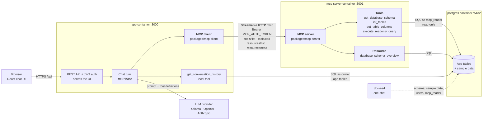

# Database-Aware LLM Chat Assistant

Ask questions about a SQL database in plain language. The LLM never touches the database directly. It calls a few read-only tools over MCP, and the app runs them and returns the results.

Live demo: https://chat.miska-mynttinen.fi/

## Architecture


<details>
<summary>Mermaid version</summary>



</details>

The app is the MCP host. On startup it connects to the MCP server, offers that server's tools to the LLM, and puts the schema overview in the system prompt. The MCP server logs in as a read-only database user, so it can't write anything or see the app's own tables.

The original thesis architecture, for reference:


## How it works

1. You send a question to `POST /api/chat`.
2. The app sends it to the LLM along with recent history and the available tools.
3. When the model calls a tool, the app runs it and sends back the result. The model gets up to 4 rounds of this.
4. The answer is saved and returned together with the tool calls.

The MCP server provides `get_database_schema`, `list_tables`, `get_table_columns` and `execute_readonly_query`. The app adds one tool of its own, `get_conversation_history`.

Supported LLMs: OpenAI, Anthropic, Ollama, and anything with a compatible API. Supported databases: SQLite, PostgreSQL and MySQL. You pick both in config.

## Quick start

You need Node 20.12+ and [Ollama](https://ollama.com).

```bash
ollama pull qwen2.5:3b

for f in .env.llm .env.database .env.mcp .env; do cp $f.example $f; done

npm install && npm --prefix frontend install && npm run build
docker compose up -d postgres      # skip if you use SQLite
npm run seed -- --sample-data

npm run mcp-server:start           # terminal 1
npm start                          # terminal 2
```

Set `.env.llm` to:

```env
LLM_PROVIDER=ollama
LLM_MODEL=qwen2.5:3b
LLM_BASE_URL=http://localhost:11434
LLM_TOOL_CALLING=native
```

For Postgres, set `.env.database` to `DB_TYPE=postgres`, `DB_PASSWORD=password`, `DB_NAME=testdb`, `DB_READONLY_USER=mcp_reader` and a `DB_READONLY_PASSWORD`. To use SQLite instead, leave the template as it is.

Then open http://localhost:3000 and log in as `user1` with password `password`. Expect 15–100 s per answer on a CPU. Some questions to try on the sample data:

| Question | Answer |
| --- | --- |
| How many products are there? | 8 |
| What is the most expensive product? | Cordless drill, 149.00 |
| Which shipments went to Finland? | SHP-2026-001, -003, -005, -008 |
| Which shipments haven't been delivered? | SHP-2026-009, SHP-2026-010 |
| Which products are in shipment SHP-2026-001? | Steel brackets, hinge sets, safety gloves |

The last question needs a join, and a 3B model sometimes gets it wrong. `qwen2.5:7b` does better. If answers seem to forget the schema, raise the context window:

```bash
printf 'FROM qwen2.5:3b\nPARAMETER num_ctx 8192\nPARAMETER temperature 0.2\n' > Modelfile
ollama create qwen2.5-db:3b -f Modelfile   # then LLM_MODEL=qwen2.5-db:3b
```

For frontend work, run `npm run frontend:dev` alongside `npm start`.

### With Docker Compose

Set `LLM_BASE_URL=http://host.docker.internal:11434` in `.env.llm`, then:

```bash
docker compose up --build
```

This starts Postgres, seeds it, and runs the MCP server and the app. It doesn't read `.env.database`. On Linux with Docker Engine, Ollama has to listen on all interfaces: `sudo systemctl edit ollama`, add `Environment="OLLAMA_HOST=0.0.0.0"`, and restart it.

## Configuration

| File | For |
| --- | --- |
| `.env.llm` | LLM provider, model, API key |
| `.env.database` | Database connection and read-only login |
| `.env.mcp` | Shared token between the app and the MCP server |
| `.env.limits` | Rate limits and daily token budgets (optional) |
| `.env` | Port, MCP URLs, JWT secret, seed password, metrics |

Every variable is documented in its `.example` template. Shell variables override the files, and the specific files override `.env`.

To use a hosted model:

```env
LLM_PROVIDER=anthropic
LLM_MODEL=claude-opus-5
LLM_API_KEY=sk-ant-...
```

## API

```bash
TOKEN=$(curl -s -X POST localhost:3000/api/auth/login \
  -H "Content-Type: application/json" \
  -d '{"username":"user1","password":"password"}' | jq -r .token)

curl -X POST localhost:3000/api/chat \
  -H "Authorization: Bearer $TOKEN" -H "Content-Type: application/json" \
  -d '{"sessionId":"demo","message":"Which tables are in the database?"}'
```

Routes: `auth/login`, `auth/register`, `auth/me`, `chat`, `sessions/:id/history`, `sessions/:id/clear`, `schema` and `health`, all under `/api`. Request and response shapes are in [ARCHITECTURE.md](ARCHITECTURE.md#api).

## Security

- **Auth.** Every route except login, register and health needs a JWT. Anyone can sign up. Sessions are private to their owner.
- **SQL guard.** The model can only run a single `SELECT`, with no comments and a row limit. The app's own tables and the system catalogues are blocked.
- **Read-only login.** On Postgres and MySQL, the MCP server connects as `DB_READONLY_USER`, so the database enforces read-only access as well as the guard. SQLite has no logins, so there the guard is the only protection.
- **Limits.** Per-IP and per-user rate limits, plus daily token budgets (see `.env.limits.example`). Behind a reverse proxy, set `TRUST_PROXY=1`. Without one, leave it at `0`, or clients can spoof their IP.
- **Origins.** Cross-site browser requests get `403`. Add your public origin to `ALLOWED_ORIGINS` if a proxy rewrites `Host`.

The details are in [ARCHITECTURE.md](ARCHITECTURE.md#database-and-sql-safety).

## Deploying

```bash
docker compose -f docker-compose.yaml -f docker-compose.prod.yaml up -d --build
```

In production mode the app refuses to start with the dev secrets from the templates. Before going live:

1. Generate `JWT_SECRET`, `POSTGRES_PASSWORD` and `MCP_AUTH_TOKEN` with `openssl rand -hex 32`, and set a real `SEED_USER_PASSWORD`.
2. Put a TLS proxy in front. Only `127.0.0.1:3000` is published.
3. Set `TRUST_PROXY=1`.
4. If you use Ollama, don't expose port 11434. It has no auth.

[gcp-deploy.md](gcp-deploy.md) is a full walkthrough for Google Cloud with Gemini and Caddy.

## Monitoring

```bash
docker compose --profile monitoring up --build
```

This adds Grafana on :3002 (login `admin`/`admin`), Prometheus on :9090, and Loki for logs. The **LLM App Overview** dashboard covers latency, errors, tokens and tool failures. The alert rules exist, but nothing sends notifications.

## Testing

```bash
npm test
```

The tests run offline, with no LLM, database server or network needed. See [ARCHITECTURE.md](ARCHITECTURE.md#testing) for running them against Postgres and MySQL.

## Troubleshooting

| Problem | Fix |
| --- | --- |
| `JWT_SECRET must be set` | Copy `.env.example` to `.env` |
| `No MCP tools registered` | Start the MCP server before the app, then restart the app |
| MCP `401` | The app and the MCP server need the same `MCP_AUTH_TOKEN` |
| `model "..." not found` | `ollama pull` it. `LLM_MODEL` must match `ollama list` exactly |
| `does not support tools` | Use a tool-capable model, or set `LLM_TOOL_CALLING=text` |
| Chat returns `500` | The LLM can't be reached. Check `curl localhost:11434/api/version` |
| `Cannot GET /` | The frontend isn't built. Run `npm --prefix frontend install && npm run build` |
| Login fails for seeded users | `npm run seed -- --reset-password` |
| `429` | Rate limit or token budget reached. Adjust it in `.env.limits` |
